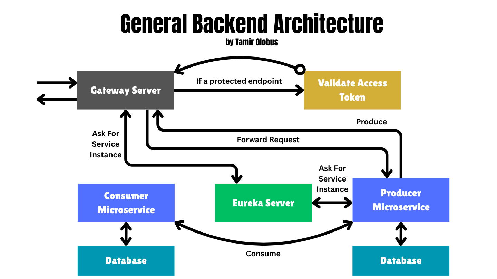
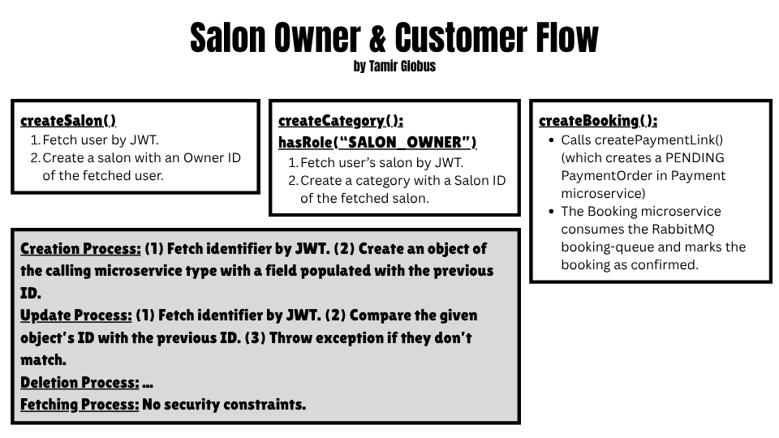

# 💇‍♀️ Salon Booking System

## 📖 Overview

Salon Booking System is a microservices-based application designed to facilitate seamless appointment scheduling for salon customers and efficient management for salon owners. It offers robust service discovery, API gateway routing, and secure OAuth2-based authentication, ensuring scalability, reliability, and security.

## 🧩 General Backend Architecture



## 🔄 Salon Owner & Customer Flows



## ✨ Features

- **✂️ Salon Service:** Handles CRUD operations for salons, including features for salon owners to manage their salons, and provides endpoints for users to browse and access salon information.
- **📅 Booking Service:** Customers can book appointments with salon owners.
- **👤 User Service:** Handles user registration, profiles, and authentication.
- **🔑 Keycloak:** Centralized identity and access management for secure authentication and authorization.
- **🔍 Eureka Server:** Centralized service discovery for microservices.
- **🚪 API Gateway:** Single entry point with request routing and cross-cutting concerns.
- **🔐 OAuth2 Resource Server:** Secures services with JWT-based authentication.
- **🗄️ PostgreSQL Databases:** Each microservice has its dedicated database for data isolation.
- **🐳 Docker & Docker Compose:** Simplified local deployment of the full microservices architecture.
- **🌱 Spring Boot & Spring Cloud:** Robust Java framework supporting microservices development.


## 🛠️ Tech Stack

- ☕ Java 21
- 🌱 Spring Boot
- ☁️ Spring Cloud (Eureka, Gateway, OAuth2 Resource Server)
- 🔐 Keycloak (Identity and Access Management)
- 🐘 PostgreSQL
- 🐳 Docker & Docker Compose
- 🧪 Postman
- 💳 Stripe API
- 📦 Maven

## 🚀 Getting Started

### ⚙️ Prerequisites

- 🐳 Docker & Docker Compose installed
- ☕ Java 21 SDK installed
- 📦 Maven installed

### 🐳 Running with Docker Compose

1. **Navigate to the Docker Compose directory:**

   ```bash
   cd docker-compose/default
   ```

2. **Create a `.env` file** in this directory to store your environment-specific variables, such as database credentials. For example:

   ```env
   POSTGRES_USER=postgres
   POSTGRES_PASSWORD=your_password
   ```

3. **Start the containers with the following command:**

   ```bash
   docker-compose up --build
   ```

### 🔧 Running Without Containers

1. **Install PostgreSQL** on your machine.

2. **Launch pgAdmin** (or your preferred SQL GUI tool).

3. **Open a new SQL query window**.

4. **Create the required databases** by running the following SQL commands:

   ```sql
   CREATE DATABASE "BookingServiceDB";
   CREATE DATABASE "CategoryServiceDB";
   CREATE DATABASE "PaymentServiceDB";
   CREATE DATABASE "SalonServiceDB";
   CREATE DATABASE "ServiceOfferingServiceDB";
   CREATE DATABASE "UserServiceDB";
   ```

5. **Open the project in IntelliJ IDEA**.

6. For each microservice:

   * Right-click on its `pom.xml` file.
   * Select **Add as Maven Project**.

7. **Configure run configurations**:

   * Go to **Run > Edit Configurations**.
   * Add a new **Spring Boot** configuration for each microservice.

8. For each microservice configuration:

   * Click **Modify Options > Environment Variables**.
   * Set your PostgreSQL credentials, for example:

     ```env
     POSTGRES_USER=postgres;
     POSTGRES_PASSWORD=your_password
     ```
   * **Configure the Payment Service environment variables:** Update the run configuration for the Payment Service by setting the following environment variables. Be sure to replace `your_stripe_secret_key` with your actual Stripe secret key:
     ```env
     POSTGRES_USER=postgres;
     POSTGRES_PASSWORD=your_password;
     STRIPE_SECRET_KEY=your_stripe_secret_key 
     ```
   * **Configure the User Service environment variables:** Update the run configuration for the User Service by setting the following environment variables. Be sure to replace the placeholder values with your actual credentials:
     ```env
     KEYCLOAK_DB_ID=your_keycloak_db_id
     KEYCLOAK_ADMIN_USERNAME=your_keycloak_admin_username
     KEYCLOAK_ADMIN_PASSWORD=your_keycloak_admin_password
     KEYCLOAK_CLIENT_SECRET=your_keycloak_client_secret
      ```
   * Save the changes.


11. **Start the Eureka Server first** and wait until it’s fully up and running.

12. **Run the remaining microservices**.
